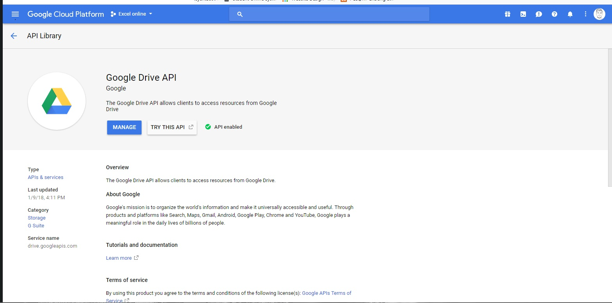
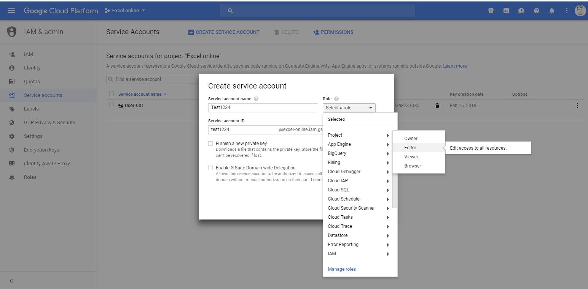

# Google-Sheets-using-Python
Accessing google sheets using python and google cloud platform api. Enabling access to google sheets to write/delete wthout using database access.

## Getting Started

These instructions will get you a copy of the project up and running on your local machine for development and testing purposes. See deployment for notes on how to deploy the project on a live system.
Using google sheets to store data instead of using a database. 

### Prerequisites

What things you need to install

* [Atom](https://atom.io) - The code editor used
* [Python](https://www.python.org) 


### Create a new project on 

[Google cloud platform](https://console.cloud.google.com/apis/dashboard)


Add google drive to the library and enable it
[Link to api library] (https://console.cloud.google.com/apis/library) 

give credentials to the google drive api by creating a service account
and select role  Project > editor


a json file will be donloaded afterwards save and rename it
and copy the client email and share the excel sheets with the mail address.
```
"client_email": "user-001@excel-online.iam.gserviceaccount.com"
```


and now we are ready to start reading the google excel and manipulate it, the rest will be annotated in the spreadsheet.py file

